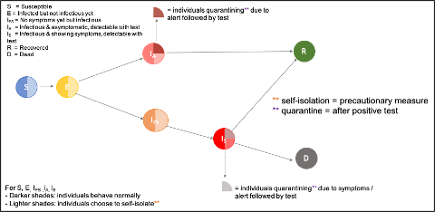
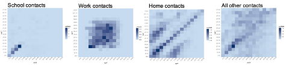

Contact-Tracing-Model for COVID-19
================
Author: Sibylle Mohr
15/06/2020

# Model team

Modelling lead: Sibylle Mohr (University of Glasgow, EPIC)

RSE core team: Sam Brett (AWE), John Nonweiler (UKAEA), Vino Mano (Man
Group)

Epidemiologist: Louise Matthews (University of Glasgow, EPIC)

# Overview

  - **Model type:** The contact-tracing model is an individual-based
    stochastic network model. It comprises of disease progression
    compartments and operates on a network of contact data to spread the
    infection.
    
      - Nodes in the network represent age-structured individuals (with
        associated features such gender, health,…)
      - Edges are represented by weighted contacts where the weight
        represents the duration of a contact

  - **Spatial scale:** No explicit spatial scale but a form of
    ‘location’ is retained

  - **Model features:** Flexible contact tracing scenarios

  - **Mode:** Forward simulation with user defined timesteps

  - **Input:** In the absence of “real” contact data (e.g. as obtained
    by contact-tracing apps), we simulated small-world networks where
    local contacts are fixed (e.g. contacts within your household) and
    long-range connections change over time (e.g. going to school, work,
    supermarkets, etc.). Contact data has been simulated for 90-days. We
    aim to use network sizes of 10,000 (contacts \~47 MB) - \~1m nodes
    (size of a large city).

# Programming

  - Implemented in Java 11

# Model structure:

The Contact-Tracing-Model is a compartmental model which includes the following states:

**Table 1.** Compartmental structure of Contact-Tracing-Model.

| Compartment                 | Symbol Definition  |                                                                                                                                                                 |
| :-------------------------- | :----------------- | --------------------------------------------------------------------------------------------------------------------------------------------------------------- |
| **Susceptible**             | **S**              | Individuals that are susceptible and have not yet been exposed. Split into individuals behaving normally and individuals self-isolating.                        |
| **Exposed Uninfectious**    | **E1**  | Latent period: Individuals that have been exposed but are not infectious. Some behave normally and some choose to self-isolate                                  |
| **Pre-symptomatic**         | **IPS** | Individuals that have been exposed and are infectious but have no symptoms. Split into those behaving normally and those choosing to self-isolate               |
| **Infectious Asymptomatic** | **IA**  | Individuals that are infected and asymptomatic. Splits into behaving normally, self-isolating, and quarantining due to an alert followed by PCR test            |
| **Infectious Symptomatic**  | **IS**  | Individuals that are infected and symptomatic. Splits into behaving normally, self-isolating, and quarantining due to symptoms or an alert followed by PCR test |
| **Recovered**               | **R**              | Individuals from the infected symptomatic or asymptomatic groups that have gone on to recover                                                                   |
| **Dead**                    | **D**              | Individuals that eventually die                                                                                                                                 |

**Figure 1.** Epidemiological flow chart of the COVID-19
Contact-Tracing-Model.

  - **Parameters**
      - Most parameters and parameter distributions are guesses derived
        from literature (for now).
      - In the future, parameters will be retrieved through the SCRC
        data pipeline.
        
        
  - **Age-mixing matrices**
      - Contact data is informed by using projected age-structured
        mixing (source: Prem et al., (2017),
        <https://doi.org/10.1371/journal.pcbi.1005697>)
      - Local fixed links home contacts
      - Long-range links school / work / other contacts
      - Links will be switched on and off based on mixing probabilities

**Figure 2.** Age-specific contact patterns by location as obtained by
Prem et al. (2017). The age-specific contact patterns (left to right) at
school, at the workplace, at home, and at other locations are projected
from the model.

# Key questions

What are the optimal contact tracing protocols (see Table 2 for possible
scenarios)? The focus is on contact-tracing apps, but the model can also
be used to investigate the manual track-and-trace programme (with
delayed contact-tracing)

  - **What are the benefits of blanket vs tailored actions and advice for alertees?**
    
      - How long should isolation be? Should it depend on the time of
        contact?
      - Testing infrastructure needed to test all alertees: how should
        testing be targeted/optimally deployed?
      - Should ‘alerting’ be focused on individuals with many contacts
        (i.e. superspreaders)?

  - **What are the behavioural changes that most improve impacts?**
    
      - Rapid testing of symptomatics;
      - Is increased uptake of app more important than compliance with
        advice?

  - **How does contact tracing combine with other exit policies, e.g.regionalisation (‘zoning’) and age or sector segmentation?**

  - **Practical implications**
    
      - Optimal protocol can be tailored to current non-pharmaceutical
        interventions e.g. closing / reopening of schools / offices etc.
        at a moment’s notice

# Exploration of contact tracing policies

The aim of contact tracing is to identify and isolate infectious people. Our goals are to determine how effective contact tracing can be (given uptake and compliance) and how much efficacy can be retained when also targeting and testing to reduce the number of people in isolation. These scenarios are designed to address these questions:

  1)	How large a reduction in R can contact tracing generate for a given uptake (of app or engagement with manual contact tracing services) and compliance with recommendations
  
  2)	How can we reduce the burden of contact tracing (i.e. reduce the number of individuals being asked to isolate) whilst maintaining high levels of efficacy, using
          a.	targeting of alerts at individuals most likely to be infected
          b.	testing of individuals to release their contacts from isolation
     
      
  3)	How much more effective does the tracing become if tracing of secondary contacts is allowed
  
  4)	What is the impact of basing alerting on a positive test result rather than symptoms

Each scenario will begin with prevalence of 1 per 10,000 and a transmission probability tuned to give a desired R value. Suggest that 2.75, 2.25, 1.75, 1.25, 0.75 provide a suitable set of R values to explore. Run simulation for 90 days or until outbreak is extinct if sooner.

  •	**Scenario 0**
No contact tracing.

  •	**Scenario 1a** 
Alerting is based on reporting by symptomatic individuals. 
Contacts of reportee from last 14 days alerted and ask to isolate for 14 days from time of alert.

  •	**Scenario 1b** 
Alerting is based on reporting by symptomatic individuals. Contacts of reportee from last 14 days alerted and asked to isolate for 14 days from time of contact.

  •	**Scenario 1c** 
Alerting is based on reporting by symptomatic individuals. Contacts of reportee from last X days alerted and asked to isolate for Y days from time of contact. Vary X and Y in range 0 to 14 and investigate trade-off between R and number of person days in isolation.

# Question 

Do we have the capacity to identify and isolate secondary contacts (in the absence of testing to initiate tracing)? If yes, we can add scenarios 1c and 1d in which we also isolate secondary contacts from time of alert and time of contact respectively.

  •	**Scenario 2a**
Alerting is based on reporting by symptomatic individuals. Choose X and Y from Scenario 1c.
Contacts of reportee most likely to be infected are alerted and asked to isolate for Y days from time of alert/time of contact.

For identification of contacts most likely to be infected, I envisage a function of time of contact, weight of contact, and no. days the reportee has been symptomatic. This function will require a little bit of thought but the key thing right now is to have the functionality in the code. In the first instance I suggest we go for a fixed delay between symptoms and reporting and have the function depend on time of contact alone.

  •	**Scenario 2b**
Alerting is based on reporting by symptomatic individuals. 
Choose X and Y from Scenario 1c.
Identify contacts most likely to be infected as in 2a. Isolate all contacts until they are tested. Release negative contacts and isolate positive contacts for Y days from time of alert.

  •	**Scenario 3**
Alerting is based on reporting by symptomatic individuals. Choose X and Y from Scenario 1c. Identify contacts most likely to be infected as in 2a. Isolate all contacts until they are tested. Release negative contacts and isolate positive contacts for Y days from time of alert. 
Now include secondary contacts, by repeating process for contacts of test positive individuals.

 •	**Scenario 4**
As scenario 2b, but alerting is based on a positive test on symptomatic individuals. Include delay between reporting symptoms and test result. How much does delay reduce impact of contact tracing.
