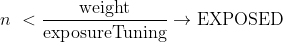
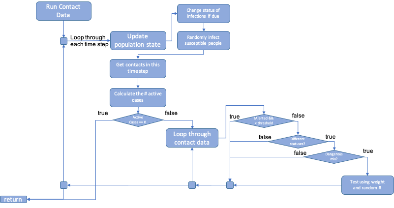
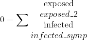
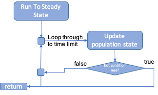
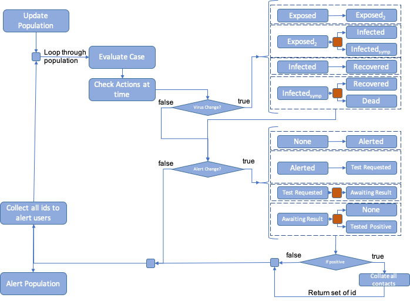
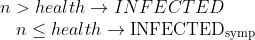
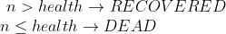

Build Documention
================
Sam Brett
27/05/2020

\===================

## Intro

This document is to describe structure, design and assumptions made in
the creation of the Contact Tracing model through the SCRC/RAMP
collaboration.

This model using a
SE1E2IaIsRD model with the
following transitions allowed:

Figure 1. The compartment model

S – Susceptible – the default condition

E1 – Exposed, but not infectious

E2 – Exposed, infectious, but not detectable by a test

Ia – Infected and asymptomatic, will test positive

Is – Infected and symptomatic, will test positive

R – Recovered

D – Dead

The progression through these transitions will be discussed throughout
this document.

## Inputs

The inputs are contained in the /inputs folder. They are in two formats,
CSV and JSON.

### Contacts.csv

The contact data is a CSV file contain network data that shows contacts
between nodes in the network. The columns are time, from, to and weight.
An example can be shown in Figure 2. The to and from fields are the ids
of the nodes in contact. The weight field is a measure of the duration,
intensity or proximity of the contact. This is dimensionless number and
is used for determining the spread of the infection and is used for
filtering the contacts should a node be alerted. NB. The time and nodes
in the CSV file are indexed from 1, the code subtracts 1 so they are
zero indexed.

Figure 2. Contacts.csv example

### DiseaseSettings.json

Figure 3 shows the contents of the disease properties file. It shows the
mean and max times between compartments of the disease. These are used
to vary the propagation between nodes. These values are used with the
random number generator to produce distributions based on the
progression distribution field. The values for this can be GAUSSIAN,
LINEAR, EXPONENTIAL or FLAT. NB LINEAR uses a uniform distribution and
FLAT returns the mean.

Exposure threshold is a minimum exposure value that is used to determine
if the contact is close enough to spread the infection. This works as a
high pass filter value with the weight field.

Exposure tuning is used to scale the weight factor when an exposure
occurs. So, if two people interact with the possibility of infection
spreading the chance of the spread occurring can be modified by dividing
the contact weight by the tuning value.

Random Exposure: this allows a proportion of the population to be
randomly exposed from outside the network. This is to simulate people
from outside the network interacting. This is the probability per
person, per timestep. So, 0.05 is 5 people in a population of 100 per
day. This value is likely to be much smaller than 0.05.

Figure 3. The diseaseSettings.json file

### PopulationSettings.json

An example of the population input can be seen in Figure 4. This file
contains three variables.

Population ages: this is a range of ages that make up a proportion of
the population, the proportion is given in the population distribution
variable

Population distribution: this is the fractional proportion of the
population that are in the group.

NB. Both population ages and distribution have to have 5 bins labelled
from 0-4.

Gender balance: this is the ratio of men:women, so there are 99 men for
every 100 women in this example. This data has been taken from Index
Mundi.

Figure 4. The population input

### RunSettings.json

The run settings file contains the main fields that a user may want to
change.

Population size: the number of nodes in a network. This can be larger or
smaller than the number of people in the contact network.

Time Limit: this is an absolute limit for how long the simulation will
go on in timesteps.

Infected: the number of the population initially infected at t=0. Must
be greater than 0.

Seed: the seed for the random number generator. Will be modified by the
command line argument if included. This ensure a reproducible output.

Steady state: if there are still active infections when the contact data
has been processed, the steady state flag enables the active cases to
reach a resolution (recovered or dead) with no further random infections
occurring.

Contacts file: points to the CSV file being used in this run.

Figure 5. the run settings file

## Virus and Alert Statuses

Following the schema described in Figure 1

the status of the virus infections in the code is referred to by an
enumeration called Virus Status, which has the options:

  - SUSCEPTIBLE

  - EXPOSED

  - EXPOSED\_2

  - INFECTED

  - INFECTED\_SYMP

  - RECOVERED

  - DEAD

Similarly, the Alert Status that a person is at is described by the
enumeration:

  - NONE

  - ALERTED

  - REQUESTED\_TEST

  - AWAITING\_RESULT

  - TESTED\_POSITIVE

Where the valid transitions are shown in Figure 6.

Figure 6. The alert status transitions

## Code Structure

The structure of the model follows the maven/gradle standard project
layout as shown in Figure 7.

Figure 7. Project and Package Layout

The code is built using the SpringBoot library with the main entry point
of the code being Framework.java. After loading and initialising the
resources required by the model, it calls ContactRunner.java, which is
where the main execution and calculation occurs. This is shown in Figure
8.

Figure 8. The top-level execution structure

### App Config

This initialised the vital parts of the code that are required for
running the model. These include the input parameters for disease,
population and execution. It is deemed a critical point of failure
should these resources not be loaded, so the code may exit here. A log
message is printed describing the error and a Configuration Exception is
thrown.

It is worth noting that this is where the command line parameters are
dealt with. At the point of writing, the only parameter is a job
identifier that can be used to modify the random number seed in a batch
job. This parameter is optional.

The input files are described in Inputs.

### Contact Runner

This class initialises the main variables that define the outbreak.
These include the population and contact data. These are fed into the
Outbreak class, which returns a history of the compartments at each time
step. These are output to a csv file.

### Population Generator

The population is parameterised from the population properties file and
the run settings. These contain census data on the age and gender
breakdown of the population. The size of the population is read from the
run settings. The “Human” class contains 4 fields that are populated
here:

#### Age

The age is determined from the census data and a uniform random number
generator.

| Age Range | Proportion | Random \# Range  |
| :-------- | :--------- | :--------------- |
| 0-19      | 0.2        | 0 \<= x \< 0.2   |
| 20-39     | 0.2        | 0.2\<= x \<0.4   |
| 40-59     | 0.2        | 0.4 \<= x \< 0.6 |
| 60-79     | 0.2        | 0.6 \<= x \< 0.8 |
| 80-99     | 0.2        | 0.8 \<= x \< 1   |

Table Example population data

For example: using the data in Table 1, if a random number, n = 0.85 is
generated the age will be in the range of 80 – 99, amin,
amax as the random number is the in range 0.8 \<= x \< 1. The
final age is calculated using

Equation how age is calculated

So, for our example

#### Gender:

The gender balance is read is as a ratio of males to females, so a
gender balance of 0.99 means there are 99 men for every 100 women. This
is the convention used in census data. The gender is calculated using
equation 2, where n is a random number and g is the gender balance

Equation how gender is calculated

#### Health

At present, health is randomly sampled from a uniform distribution. It
may later have some relation to age. A health score of 1 is assumed to
be a very healthy individual, a score of 0 is a very frail individual.

#### Compliance

At present, the compliance field is randomly sampled from a uniform
distribution. A score of 0 is someone who will ignore any restrictions
placed upon them totally, a score of 1 will obey totally.

### Contact Reader

The contact reader reads data from the contact.csv file and generates a
map of contacts that occur on any given timestep. This serves as the
data that drives the model. The data is also filtered by the maximum
number of people in the simulation. For example, a set of contact data
may include many millions of people, however if a simulation is only for
10,000 the data for the 10,001+ people are not included in the
simulation.

### Outbreak

The outbreak class will be handled in much more detail later on in
\<\<Section XYZ\>\>. This section will focus purely on the
initialisation.

The Outbreak class is a Service Bean, so it is created as part of the
App Config section, it is initialised with data in Contact Runner. It
requires the population and contact records to be passed to it before
the propagate method can be called. This method is what runs through the
contact data.

The propagate method returns a map of compartment records for each day,
i.e. how many people are in each state of infection.

### Producing compartments output

The compartment data is returned from the outbreak.propagate() method.
This is sent to a writer which outputs a CSV file. An example is shown
in Figure 9.

Figure 9. Example of CSV output

## Modelling an outbreak

In 4.5 the propagate method was mentioned in passing. The following
section fills in the details on how this section works. Figure 10 shows
the top level of how the propagation algorithm works and where it calls
to. These will be broken down in turn in the following sections.

Upon entering the method, a set of infected cases are created based on
the input value from the run settings. These members of the population
are randomly sampled and set to EXPOSED to begin the simulation.

Once the initial infections are allocated the runToCompletion method is
called. This extracts some key variables from the input parameters,
these include:

timeLimit : the maximum duration of the simulation. This will exit the
code even if active cases are present. It has the highest precedent.
This is to stop any codes hanging should an error occur that is not
foreseen.

steadyState: this allows the code to run until there are no active cases
(everyone is S, R or D), but will exit if timeLimit is reached.

maxContact: this take the contact data and finds the last time point at
which we have a record.

RandomInfectionRate: this is the rate of randomly spawned infections per
day.

If the time limit is less than or equal to the max contact time, a
warning is logged that not all contact data is used and the steady state
flag will be disabled.

Figure 10. The propagation routine

After this the contact data is run. This will be covered in more depth
in section 5.1.

Should the steady state flag be true, and the time limit not reached, it
will then call run to steady state solution. This is covered in section
5.2.

Finally, the population data is examined to create a map of infections
and how they propagate through the network. To do this, the initial set
of seed infections and the random exposures are collected into a set.
The population is the searched to look for infections caused by this
seed. These in turn are examined recursively after which a map of
infection propagation can be output. This can be seen in Figure 11 with
some labels.

The first number is the id of the seed infection, the number in rounded
brackets is the time they were infected. The square brackets then denote
the set of infections caused by the preceding infection. This can be one
or many. The following lines then show the infections caused by that
set. If the chain ends, it means the final link didn’t infect anyone.

Figure 11. Infection map example

### Run Contact Data

Running the propagation of infection is the heart of the calculation.
Figure 12 shows the flow of data.

To begin with the update population method is called. This changes the
state of any infection that is due to change on this day. This is
explained further in 5.3. This is also where random infections are added
to the mix. This is done by running a random number test against each
susceptible case and setting their status to EXPOSED.

Following this, the contact data for this timestep is extracted along
with the number of active cases (those not S, R or D), if this is zero
and random infections are off, it will exit here. Otherwise, it will
loop over the contact data.

The contact data is evaluated using a series of conditionals. Firstly,
the alert status and weight of the contact are reviewed to see if this
is a significant contact. If both alert statuses are NONE and the weight
of the contact is greater than exposureThreshold, it is a contact of
interest. Before evaluating the contact further, the two cases are
checked to see if their virus statuses are different, if they are the
contact is evaluated.

The two cases are evaluated to see who is in the more severe state,
these are described by the rankings:

| \-1 | DEAD           |
| :-- | :------------- |
| 0   | SUSCEPTIBLE    |
| 1   | RECOVERED      |
| 2   | EXPOSED        |
| 3   | EXPOSED\_2     |
| 4   | INFECTED       |
| 5   | INFECTED\_SYMP |

PersonA is the more severe case; the least severe case is personB. A
dangerous mix is when personA is infectious (E2, I, IA) and personB is
susceptible. If this is the case, the following test is conducted:

Where n is a random number.

Figure 12. The logic flow for reviewing contact data

### Run to Steady State

During the run to Steady-state routine, shown in Figure 13, updates the
population statuses until the existing active cases are resolved, i.e.
all active cases resolve in recovery or death. The exit condition is

Figure 13. The run to completion algorithm

### Update population

The update population algorithm, shown in Figure 14, is run as part of
Run Contact Data and Steady State. Each case has fields containing the
next time their statuses change.

Figure 14. The update population algorithm

#### Virus Status

The virus status is updated first, both Exposed and Infected have a
single option, which they progress to, the next status change is
calculated using the mean and max times from the disease properties and
the chosen random number distribution. Exposed2 and
Infectedsump have two options, denoted by the red box. These
are chosen by random number, n:

Likewise, the outcome of an Infectedsump is determined by:

#### Alert Status

The alert status only has one choice, the outcome of the test. In this
method, the result of the test is determined by the step before, i.e.
the recipient of the test needs to be infectious when tested, not when
receiving the result. The red box here denotes the storing of a Boolean
of ‘wasInfected’ at the time the test was taken. This is then used when
the test result is in.

## Assumptions

  - At present, contacts do not use the compliance field and obey alert
    status absolutely.

  - A negative test sends the alert status back to NONE.

  - Alerts currently go back through all time

  - A negative test sets the status back to NONE

  - A person tested when not detectable, who subsequently dies does not
    have their contacts alerted

  - Dice roll against health for infection type (gender and age should
    be included)

  - Dice roll against health for recovered/death (gender and age should
    be included)

  - Test positive is the final stage. Should we consider immunity?

## Document version history

Version 1 – drafted 27 May 2020
