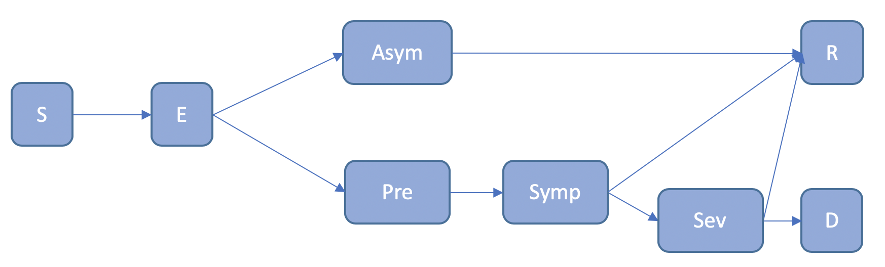
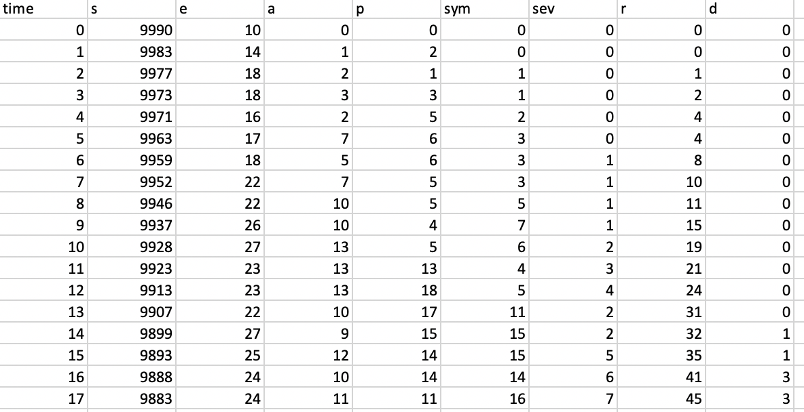

Build Documention
================
Author: Sam Brett

## Intro

This document is to describe structure, design and assumptions made in
the creation of the Contact Tracing model through the SCRC/RAMP
collaboration.

This model using a
SE1E2IaIsRD model with the
following transitions allowed:

Figure 1. The compartment model

S – Susceptible – the default condition

E – Exposed, but not infectious

Asym – Infected and asymptomatic, will test positive

Pre – Infected and developing symptoms, will test positive

Sym – Infected and symptomatic, will test positive

Sev – Infected and severely symptomatic, will test positive 

R – Recovered

D – Dead

The progression through these transitions will be discussed throughout
this document.

## Inputs

The inputs are contained in the /inputs folder. They are in two formats,
CSV and JSON.

### InputLocations.json

The first input file is the inputLocations.json file that allows all the other inputs to be configured. 
This allows the user to have multiple configurations defined. File locations are relative to the input folder.

 

### Contacts.csv

The contact data is a CSV file contain network data that shows contacts
between nodes in the network. The columns are time, from, to and weight.
An example can be shown in Figure 2. The to and from fields are the ids
of the nodes in contact. The weight field is a measure of the duration,
intensity or proximity of the contact. This is dimensionless number and
is used for determining the spread of the infection and is used for
filtering the contacts should a node be alerted. The addition of a label 
field is to enable filtering of contacts based on their label.

Figure 2. Contacts.csv example

### DiseaseSettings.json

Figure 3 shows the contents of the disease properties file. It shows the
mean and max times between compartments of the disease. These are used
to vary the propagation between nodes. These values are used with the
random number generator to produce distributions based on the
progression distribution field. The values for this can be GAUSSIAN,
LINEAR, EXPONENTIAL or FLAT. NB LINEAR uses a uniform distribution and
FLAT returns the mean.

Exposure threshold is a minimum exposure value that is used to determine
if the contact is close enough to spread the infection. This works as a
high pass filter value with the weight field.

Exposure tuning is used to scale the weight factor when an exposure
occurs. So, if two people interact with the possibility of infection
spreading the chance of the spread occurring can be modified by dividing
the contact weight by the tuning value.

Random Exposure: this allows a proportion of the population to be
randomly exposed from outside the network. This is to simulate people
from outside the network interacting. This is the probability per
person, per timestep. So, 0.05 is 5 people in a population of 100 per
day. This value is likely to be much smaller than 0.05.

Figure 3. The diseaseSettings.json file

The exposureProbability4UnitContact (expUnitContact) and exposureExponent (exp) values are 
used to determine the chance of infection for a given contact. 

### PopulationSettings.json

An example of the population input can be seen in Figure 4. This file
contains three variables.

Population ages: this is a range of ages that make up a proportion of
the population, the proportion is given in the population distribution
variable

Population distribution: this is the fractional proportion of the
population that are in the group.

NB. Both population ages and distribution have to have 5 bins labelled
from 0-4.

Gender balance: this is the ratio of men:women, so there are 99 men for
every 100 women in this example. This data has been taken from Index
Mundi.

Figure 4. The population input

### Initial Exposures

The initial exposures file contains a list of IDs of the people who are in the
exposed category at t=0. If this list is longer than the initial exposures, it 
will be truncated. If it is too short, it will be filled randomly. 

### RunSettings.json

The run settings file contains the main fields that a user may want to
change.

Population size: the number of nodes in a network. This can be larger or
smaller than the number of people in the contact network.

Time Limit: this is an absolute limit for how long the simulation will
go on in timesteps.

Infected: the number of the population initially infected at t=0. Must
be greater than 0.

Steady state: if there are still active infections when the contact data
has been processed, the steady state flag enables the active cases to
reach a resolution (recovered or dead) with no further random infections
occurring.

(Optional) Seed: Can be specified on the command line or fixed.

Figure 5. the run settings file

## AgeData

The age data file contains a list of id and age. This has been added 
to allows the user to use age graduated contact files. Should the file 
be longer than the population, additional input will be ignored. Should 
it be shorter, the ages will be generated as per the population settings file. 

## Isolation Policies

The isolation policy can be split into 3 sections.

### Virus Policy

This policy determines the probability of a person in a given compartment 
isolating, and for how long they will isolate. These can be modified and 
varied using the distribution times. Also the time in isolation can vary 
between ABSOLUTE or CONTACT_TIME. This means if a person becomes infected 
they will either isolate for the isolation time from either the time of contact 
or the time they are aware of being infected.

### Default Policy

The default policy allows a global baseline to be set. For example, 
in an older population 10% of the population may shield.

### Alert Policy

The alert policy defines the isolation policy for a person in any state. 
These follow the same rules as the Virus Policy.

## Tracing Policies

The tracing policy allows specification of alerts to be triggered when a person enters a 
combined alert and virus status. The code will review their contacts for a number of specified days
and trigger alerts to their contacts. 

## Virus and Alert Statuses

Following the schema described in Figure 1

the status of the virus infections in the code is referred to by an
enumeration called Virus Status, which has the options:

  
  - SUSCEPTIBLE

  - EXPOSED
  
  - ASYMPTOMATIC
  
  - PRESYMPTOMATIC
  
  - SYMPTOMATIC
  
  - SEVERELY_SYMPTOMATIC
  
  - RECOVERED
    
  - DEAD
  
Similarly, the Alert Status that a person is at is described by the
enumeration:

  - NONE

  - ALERTED

  - REQUESTED\_TEST

  - AWAITING\_RESULT

  - TESTED\_POSITIVE

Where the valid transitions are shown in Figure 6.

Figure 6. The alert status transitions

## Code Structure

The structure of the model follows the maven/gradle standard project
layout as shown in Figure 7.

Figure 7. Project and Package Layout

The code is built using the SpringBoot library with the main entry point
of the code being Framework.java. After loading and initialising the
resources required by the model, it calls ContactRunner.java, which is
where the main execution and calculation occurs. This is shown in Figure
8.

Figure 8. The top-level execution structure

### App Config

This initialised the vital parts of the code that are required for
running the model. These include the input parameters for disease,
population and execution. It is deemed a critical point of failure
should these resources not be loaded, so the code may exit here. A log
message is printed describing the error and a Configuration Exception is
thrown.

There are three optional command line interfaces:
- **seed:** allows a seed to be input. Defaults to a random seed.
- **overrideInputFolderLocation:** allows a different input folder to be assigned. Defaults to /input.
- **overrideOutputFolderLocation:** allows a different output folder to be assigned. Defaults to /output.

The input files are described in Inputs.

### Contact Runner

This class initialises the main variables that define the outbreak.
These include the population and contact data. These are fed into the
Outbreak class, which returns a history of the compartments at each time
step. These are output to a csv file.

### Population Generator

The population is parameterised from the population properties file and
the run settings. These contain census data on the age and gender
breakdown of the population. The size of the population is read from the
run settings. The “Human” class contains 4 fields that are populated
here:

#### Age
If the ages are not provided in the AgeData file, the ages are determined from the census data and a uniform random number
generator.

| Age Range | Proportion | Random \# Range  |
| :-------- | :--------- | :--------------- |
| 0-19      | 0.2        | 0 \<= x \< 0.2   |
| 20-39     | 0.2        | 0.2\<= x \<0.4   |
| 40-59     | 0.2        | 0.4 \<= x \< 0.6 |
| 60-79     | 0.2        | 0.6 \<= x \< 0.8 |
| 80-99     | 0.2        | 0.8 \<= x \< 1   |

Table Example population data

For example: using the data in Table 1, if a random number, n = 0.85 is
generated the age will be in the range of 80 – 99, amin,
amax as the random number is the in range 0.8 \<= x \< 1. The
final age is calculated using

Equation how age is calculated

So, for our example

#### Gender:

The gender balance is read is as a ratio of males to females, so a
gender balance of 0.99 means there are 99 men for every 100 women. This
is the convention used in census data. The gender is calculated using
equation 2, where n is a random number and g is the gender balance

Equation how gender is calculated

#### Health

At present, health is randomly sampled from a uniform distribution. It
may later have some relation to age. A health score of 1 is assumed to
be a very healthy individual, a score of 0 is a very frail individual.

#### Isolation Compliance

At present, the compliance field is randomly sampled from a uniform
distribution. A score of 0 is someone who will ignore any restrictions
placed upon them totally, a score of 1 will obey totally.

#### Reporting Compliance

At present, the compliance field is randomly sampled from a uniform
distribution. A score of 0 is someone who will not report an illness, 
a score of 1 means they are guaranteed to report. 

### Contact Reader

The contact reader reads data from the contact.csv file and generates a
map of contacts that occur on any given timestep. This serves as the
data that drives the model. The data is also filtered by the maximum
number of people in the simulation. For example, a set of contact data
may include many millions of people, however if a simulation is only for
10,000 the data for the 10,001+ people are not included in the
simulation.

### Outbreak

The outbreak class will be handled in much more detail later on. 
This section will focus purely on the initialisation.

The Outbreak class is a Service Bean, so it is created as part of the
App Config section, it is initialised with data in Contact Runner. It
requires the population and contact records to be passed to it before
the propagate method can be called. This method is what runs through the
contact data.

The propagate method returns a map of compartment records for each day,
i.e. how many people are in each state of infection.

### Producing compartments output

The compartment data is returned from the outbreak.propagate() method.
This is sent to a writer which outputs a CSV file. An example is shown
in Figure 9.

Figure 9. Example of CSV output

## Modelling an outbreak

In 4.5 the propagate method was mentioned in passing. The following
section fills in the details on how this section works. Figure 10 shows
the top level of how the propagation algorithm works and where it calls
to. These will be broken down in turn in the following sections.

Upon entering the method, a set of infected cases are read from the initial 
exposures file. If this file is shorter than the value specified in 
RunSettings, they will be filled to the correct length. Likewise, if it is too 
long, it is truncated to the correct length.

Once the initial infections are allocated the runToCompletion method is
called. This extracts some key variables from the input parameters,
these include:

timeLimit : the maximum duration of the simulation. This will exit the
code even if active cases are present. It has the highest precedent.
This is to stop any codes hanging should an error occur that is not
foreseen.

steadyState: this allows the code to run until there are no active cases
(everyone is S, R or D), but will exit if timeLimit is reached.

maxContact: this take the contact data and finds the last time point at
which we have a record.

RandomInfectionRate: this is the rate of randomly spawned infections per
day.

If the time limit is less than or equal to the max contact time, a
warning is logged that not all contact data is used and the steady state
flag will be disabled.

Figure 10. The propagation routine

After this the contact data is run. This will be covered in more depth
in section 5.1.

Should the steady state flag be true, and the time limit not reached, it
will then call run to steady state solution. This is covered in section
5.2.

Finally, the population data is examined to create a map of infections
and how they propagate through the network. To do this, the initial set
of seed infections and the random exposures are collected into a set.
The population is the searched to look for infections caused by this
seed. These in turn are examined recursively after which a map of
infection propagation can be output. This can be seen in Figure 11 with
some labels.

The first number is the id of the seed infection, the number in rounded
brackets is the time they were infected. The square brackets then denote
the set of infections caused by the preceding infection. This can be one
or many. The following lines then show the infections caused by that
set. If the chain ends, it means the final link didn’t infect anyone.

Figure 11. Infection map example

### Run Contact Data

The runContactData method within Outbreak.java is where the main calculations in the code are triggered. 

## Event Runner

The events within the model are handled by a group of lists that contain specific events that can occur in the model. These are:

1.	Alert Event
2.	Contact Event
3.	Infection Event
4.	Virus Event

Each of these events are processed in different ways and can trigger other events to occur at a future time. 

### Contact Event

Contact events are set in the contacts.csv file. They involve the interaction between two people at a given time. 
The duration/proximity of the event is measured using the weight parameter. 

When a contact event takes place the two people are assessed based on their Virus Statuses, this allows the model to 
assess if the contact has the potential to spread the infection. One or both of the contacts may be in isolation, 
so the contact may not take place. The isolation policies are expanded upon below. 

### Alert Event

The alert event processor is used to cycle through the states of disease alert that a member of the population can be in at any one point. 

The person has their status set to a corresponding status and the next status is calculated for a time in the future. 
The result of the test is determined by whether the individual is currently infectious and a dice roll against the accuracy 
of the test. The number of false positives and negatives is recorded as an output statistic. 

### Infection Event

TODO: Rewrite
### Virus Event

A virus event is the progression of the virus through in compartments. The initial infection is not included as this is 
an Infection Event. The processing of the event is very similar to the previous sections, with the exception of checking 
for alerts based on the virus status of the individual. This process creates alert events for people who have been in 
contact with the individual. The individual has a reportingCompliance field that may reduce the chance of an individual
reporting symptoms. The alert checker and tracing policies are covered below.  

## Isolation Policy

The isolation policy logic is stored in the policy.isolation package. A list of policies is input from the 
isolationPolicies.json file. These include policies for global, virus status, alert status and a default. 
The default policy will typically be to not isolate. Each policy has a priority value which allows the most relevant policy to be chosen. 

### Global Policies
Global policies are based on the proportion of the population infected. For example, a “stay at home” policy may be put 
into place if more than 10% of the population are infected, whereas a “stay alert” policy may be in place if 
between 5-10% of the population are infected. These values are as an example and can be configured in the input. 

### 	Virus Status Policies
An isolation policy can be defined based on the virus status of an individual. For example, symptomatic individuals 
may be required to stay at home for a defined period. The proportion required to isolate and duration of the isolation can be defined in the input. 

### 	Alert Status Policies
A policy can be defined for any of the alert statuses, much like with a virus status, the proportion required to isolate 
and duration of the isolation can be defined in the input. 

### 	Determining Isolation Policy

The isolation status of all individuals is stored in a map. These are used to determine if an individual has already 
been isolation, in which case they may not need a further isolation applied to them. 

The policies are grouped, sorted and selected by:

## Tracing Policy

A tracing policy is triggered when an individual reports themselves as having symptoms. The policy input has been 
covered above. A combination of Virus and Alert statuses are used to trigger contact tracing. It is possible to look 
back through the contacts over a number of days and inform individuals that they should isolate. 

## Assumptions

  - At present, contacts do not use the compliance field and obey alert
    status absolutely.

  - A negative test sends the alert status back to NONE.

  - Alerts currently go back through all time

  - A negative test sets the status back to NONE

  - A person tested when not detectable, who subsequently dies does not
    have their contacts alerted

  - Dice roll against health for infection type (gender and age should
    be included)

  - Dice roll against health for recovered/death (gender and age should
    be included)

  - Test positive is the final stage. Should we consider immunity?

## Document version history

Version 1 – drafted 27 May 2020
Version 2 - updated 26 July 2020
