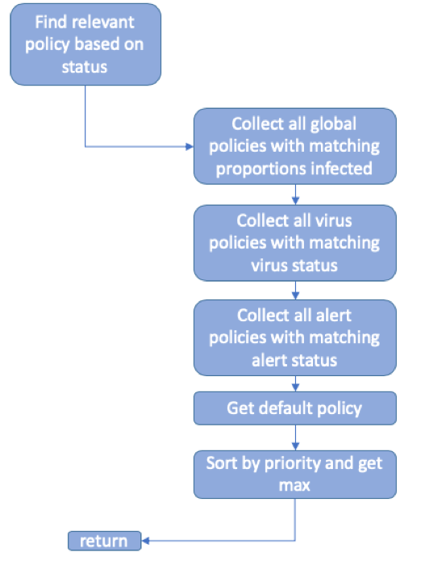

Build Documention
================
Author: Sam Brett & Ed Townsend

## Contents

  - [Introduction](#introduction)
  - [Input Files](#input-files)
    - [Local Input Files](#local-input-file)
      - [Input Locations](#input-locations)
      - [Contact Data](#contact-data)
      - [Infection Rates](#infection-rates)
      - [Initial Exposures](#initial-exposures)
      - [Run Settings](#run-settings)
      - [Age Data](#age-data)
      - [Isolation Policies](#isolation-policies)
      - [Tracing Policies](#tracing-policies)
    - [Data Pipeline Input Files](#data-pipeline-input-files)
      - [Disease Settings](#disease-settings)
      - [Population Settings](#population-settings)
  - [Isolation Policies](#main-isolation-policies)

## Introduction

This document is to describe the structure, design and assumptions made in
the creation of the Contact Tracing Model through the SCRC/RAMP
collaboration.

This model uses a S-E-Asym-Pre-Sym-Sev-R-D model that allows the following transitions:

**Figure 1.** The compartment model

S – Susceptible – the default condition

E – Exposed, but not infectious

Asym – Infected and asymptomatic, will test positive

Pre – Infected and developing symptoms, will test positive

Sym – Infected and symptomatic, will test positive

Sev – Infected and severely symptomatic, will test positive 

R – Recovered

D – Dead

The progression through these transitions will be discussed throughout
this document.

## Input Files

The inputs are contained in the _/inputs_ folder, located in the root directory of the Contact Tracing Model. All input files come in one of three formats: CSV, JSON and TOML.

Some of the input files used by the Contact Tracing Model are obtained through the Data Pipeline API (**#REF!**). These files have the extension _.toml_.

### Local Input Files

#### Input Locations

The _Input Locations_ file allows the user to specify the location of all input files, except those retrieved through the Data Pipeline API, relative to the _/input_ folder, which is located in the root of the Contract Tracing Model directory. This allows the user to organise multiple simulation configurations without overwriting existing configurations within the _/input_ folder.

The name of the _Input Locations_ file must be set to _inputLocations.json_.

**Figure 1.** Example _inputLocations.json_ file.

An example of the expected input files is illustrated above in Figure 1. If a file is omitted from _inputLocations.json_ then the Contact Tracing Model will default to the corresponding file in the _/input_ folder. 

Should the Contact Tracing Model fail to acquire a specified file, an error will be thrown.

The directory of the input files defaults to the _/input_ folder, but may be overridden via the command line. See XXXX for more details.

#### Contact Data

The _Contact Data_ is stored within a CSV file that contains the data of a temporal network of contacts between individuals in a population.
The columns in the _Contact Data_ file are:
  * _time_
    * The time that the contact occurs.
  * _from_
    * The first individual's ID.
    * Sometimes referred to as a node in the contact network.
  * _to_
    * The second individual's ID.
    * Sometimes referred to as a node in the contact network.
  * _weight_
    * The weighting associated with the interaction. 
    * The likelihood of an infectious individual infecting the other is proportional to the weighting factor.
    * More details regarding the use of the weighting factor can be found [here](#diseasesettings).
  * _label_
    * The location of where the interaction occurs.
    * The label is not currently used in the current version of the Contact Tracing Model.

An example of the contents of a _Contacts Data_ file can be found in Figure 2.

**Figure 2.** Example contact data file.

#### Infection Rates

The _Infection Rates_ file allows the user to provide a weighting factor to individuals in an infectious virus compartment. Figure 4 shows an example _Infection Rates_ file. The specified weighting factor values must lie in the range (0, 1], otherwise an error is thrown.

**Figure 4.** Example _Infection Rates_ file.

#### Initial Exposures

At the beginning of a simulation there needs to be a number of infected individuals to start the spread of the disease. The IDs of individuals who are initially infected are specified in an _Initial Exposures_ file. This file is a CSV with one column of IDs of the individuals to be infected. 

Should the number of individuals specified in the _Initial Exposures_ file differ from the value specified in the [_Run Settings_](#runsettings) file, then the data will be truncated if too long, or randomly allocated if too short.  

#### Run Settings

The _Run Settings_ file contains the main fields that a user may want to
change. An example of a _Run Settings_ file can be found below in Figure 6.

**Figure 6.** Example _Run Settings_ file.

The _populationSize_ field defines the total number of individuals in a population. This value can be smaller or larger than the number of people in the contact network.

The _timeLimitDays_ field defines the absolute limit for how many (simulation) days the simulation will run for.

The _initialExposures_ field defines the number of initially infected individuals. This value must be greater than zero.

The _steadyState_ flag is not used. It is likely to be removed in future versions of the Contact Tracing Model.

The _timeStepsPerDay_ field sets the number of timesteps to occur each day, e.g. half days ('2') or quarter days ('4').

The _timeStepSpread_ field sets the probability for spreading the disease in each chosen timestep, , e.g. for half days [0.4, 0.6] or quarter days [0.2, 0.2, 0.4, 0.2]. If the sum of the probabilities does not add to 1 an error will be thrown.

**NOTE:** It is recommended to use a combination of _timeStepsPerDay_ and _timeStepSpread_ such that recurring decimal values are avoided to ensure the probabilties sum to 1. Alternatively, the remainder can be calculated and added to one of the probabilities.

The _seed_ field can be specified via the command line or in the _Run Settings_ file. If no seed is provided, a seed will be generated randomly.

**NOTE:** Currently, the Contact Tracing Model does not log which seed is being used when randomly generated.

The _dayOffset_ field offsets the contact data by the specified number of days. This allows flexibility when using contact data from different sources who may employ differing convections of labelling the first day. For example, the Contact Tracing Model considers the first day to occur between timesteps [0, 1), however some contact data may start from the first day being indexed by 1. To avoid missing contact data, the _dayOffset_ field aligns the Contact Tracing Model to the _Contact Data_ file.

#### Age Data

The _Age Data_ file assigns an age to an individual via their ID. The _Age Data_ takes precedence over the age data within the _Population Settings_ file. Figure 7 shows an example _Age Data_ file.

**Figure 7.** Example _Age Data_ file.

#### Isolation Policies

#### Tracing Policies

### Data Pipeline Input Files

#### Population Settings

The _Population Settings_ file contains details that define the population for a given simulation. The file contains data pertaining to:
  * The age distribution of a population.
  * The population gender balance.
  * The proportion of the population that can be tested per day.
  * The proportion of the population that use the contact tracing app.
  
An example of the a _Population Settings_ file can be found below in Figure 5.

**Figure 5.** Example population settings file.

The _populationDistribution_ field contains the fraction of the population whose age falls within a given age bin (seen in the _populationAges_ field). The sum of fractions should equal to 1. A warning/error will be raised if the values do not sum to 1.

The _populationAges_ field define the upper and lower (inclusive) bounds of the age bin. If an individual has not been assigned an age (see [here](#agedata)), the age bins, together with the fractions in _populationDistribution_ field, will be used to assigne an age to the individual by sampling from a uniform distribution.

**NOTE:** The population distribution must have 5 bins, otherwise an error will be thrown.

The _genderBalance_ field is the ratio of men:women, so there are 99 men for
every 100 women in this example. This data has been taken from Index
Mundi.

The _testCapacity_ field is the proportion of the population that can be tested per day. Should the testing capacity be exceeded, an individual waiting to be tested will be tested on the next available testing day.

The _appUptake_ field defines the proportion of the population that is actively using the contact tracing app. 

#### Disease Settings

The _Disease Settings_ file contains the parameters that define the behaviour of the disease. Within this file, the user can change the following quantities:
  * The parameters of the distributions used to sample the duration an individual spends in a given virus compartment.
  * The likelihood of a test producing a false negative or false positive result.
  * The distribution used to sample the duration a test takes to be administered.
  * The distribution used to sample the duration a test result takes to be delivered.
  * The parameters to determine the probability of being exposed through an interaction.
  * Proportion of population randomly infected per timestep.
  
 

**Figure 3.** Example _Disease Settings_ file
  
Figure 3 shows the contents of an example _Disease Settings_ file. For each entry defining the duration an individual spends in a virus compartment and the testing durations, there is a corresponding _mean_ and _max_ field. These correspond to the mean and maximum values that parameterise the chosen distibution, specified by the _progressionDistribution_ field.

The _progressionDistribution_ field accepts the follow distributions:
* GAUSSIAN
  * **NOTE:** the standard deviation is set to half of the mean value. This will be changed in a future version of the Contact Tracing Model.
* EXPONENTIAL
* LINEAR
  * A uniform distribution.
* FLAT
  * A constant value given by the mean.

**NOTE:** Currently, the Contact Tracing Model only allows one distribution type to be specified at a time. For example, it is not possible to sample _timeTestAdministered_ from a GAUSSIAN and _timeRecoveryAsymp_ from an EXPONENTIAL distribution in the same simulation.

The _testPositiveAccuracy_ and _testNegativeAccuracy_ fields represent the probability of a test result being a false positive or false negative. For example, if a test result is negative and the _testNegativeAccuracy_ value is 0.95, then there is a 5% chance this result will be a false negative. These quantities are sampled from a uniform (or LINEAR) distribution and not the distribution specified by the _progressionDistribution_ field.

The _exposureThreshold_ field is a minimum exposure value that is used to determine
if a contact is close enough to spread the infection. This works as a
high pass filter value with the weight field.

The _randomInfectionRate_ field allows a proportion of the population to be
randomly exposed from outside the contact network per day. This is to simulate people
from outside the network interacting with the population. This is the probability an individual will randomly get infected per timestep. For example, a _randomInfectionRate_ of 0.05 will result in 5 people in a population of 100, per
timestep, to get infected.

The _exposureProbability4UnitContact_ (expUnitContact) and _exposureExponent_ (exp) values are 
used to determine the chance of infection for a given contact, along with the weighting value in the _Contact Data_ file. The mathematical implementation of the aforementioned quantites can be found in the images below.

# Isolation Policies

There are four types of isolation policies:
  * Global Policy
  * Virus Policy
  * Alert Policy
  * Default Policy
  
All four policy types are definied with an _Isolation Policies_ file.

### Global Policy

### Virus Policy

A _Virus Policy_ defines the probability of an individual isolating and duration over which they will isolate, in a given virus compartment. A _Virus Policy_ can be varied by a distribution type and parameters, as seen in section [_Disease Settings_](#diseasesettings), and priority associated with the _Virus Policy_.

A _Virus Policy_ can be specified in the _Isolation Policies_ file under the field named _virusStatusPolicies_.

This policy determines the probability of a person in a given compartment 
isolating, and for how long they will isolate. These can be modified and 
varied using the distribution times. Also the time in isolation can vary 
between ABSOLUTE or CONTACT_TIME. This means if a person becomes infected 
they will either isolate for the isolation time from either the time of contact 
or the time they are aware of being infected.

**Figure 8.** Example _Virus Policy_.

### Default Policy

The default policy allows a global baseline to be set. For example, 
10% of the population may be shielding by default.

### Alert Policy

The alert policy defines the isolation policy for a person in any alert state. 
These follow the same rules as the Virus Policy. The alert policy is related to the status of the individual. 

## Tracing Policies

The tracing policy allows specification of alerts to be triggered when a person enters a 
combined alert and virus status. The code will review their contacts for a number of specified days
and trigger alerts to their contacts. 

## Virus and Alert Statuses

Following the schema described in Figure 1

the status of the virus infections in the code is referred to by an
enumeration called Virus Status, which has the options:

  
  - SUSCEPTIBLE

  - EXPOSED
  
  - ASYMPTOMATIC
  
  - PRESYMPTOMATIC
  
  - SYMPTOMATIC
  
  - SEVERELY_SYMPTOMATIC
  
  - RECOVERED
    
  - DEAD
  
Similarly, the Alert Status that a person is at is described by the
enumeration:

  - NONE

  - ALERTED

  - REQUESTED\_TEST

  - AWAITING\_RESULT

  - TESTED\_POSITIVE

Where the valid transitions are shown in Figure 6.

Figure 6. The alert status transitions

## Code Structure

The structure of the model follows the maven/gradle standard project
layout as shown in Figure 7.

Figure 7. Project and Package Layout

The code is built using the SpringBoot library with the main entry point
of the code being Framework.java. After loading and initialising the
resources required by the model, it calls ContactRunner.java, which is
where the main execution and calculation occurs. This is shown in Figure
8.

Figure 8. The top-level execution structure

### App Config

This initialised the vital parts of the code that are required for
running the model. These include the input parameters for disease,
population and execution. It is deemed a critical point of failure
should these resources not be loaded, so the code may exit here. A log
message is printed describing the error and a Configuration Exception is
thrown.

There are three optional command line interfaces:
- **seed:** allows a seed to be input. Defaults to a random seed.
- **overrideInputFolderLocation:** allows a different input folder to be assigned. Defaults to /input.
- **overrideOutputFolderLocation:** allows a different output folder to be assigned. Defaults to /output.

The input files are described in Inputs.

### Contact Runner

This class initialises the main variables that define the outbreak.
These include the population and contact data. These are fed into the
Outbreak class, which returns a history of the compartments at each time
step. These are output to a csv file.

### Population Generator

The population is parameterised from the population properties file and
the run settings. These contain census data on the age and gender
breakdown of the population. The size of the population is read from the
run settings. The “Human” class contains 5 fields that are populated
here:

#### Age
If the ages are not provided in the AgeData file, the ages are determined from the census data and a uniform random number
generator.

| Age Range | Proportion | Random \# Range  |
| :-------- | :--------- | :--------------- |
| 0-19      | 0.2        | 0 \<= x \< 0.2   |
| 20-39     | 0.2        | 0.2\<= x \<0.4   |
| 40-59     | 0.2        | 0.4 \<= x \< 0.6 |
| 60-79     | 0.2        | 0.6 \<= x \< 0.8 |
| 80-99     | 0.2        | 0.8 \<= x \< 1   |

Table Example population data

For example: using the data in Table 1, if a random number, n = 0.85 is
generated the age will be in the range of 80 – 99, amin,
amax as the random number is the in range 0.8 \<= x \< 1. The
final age is calculated using

Equation how age is calculated

So, for our example

#### Gender:

The gender balance is read is as a ratio of males to females, so a
gender balance of 0.99 means there are 99 men for every 100 women. This
is the convention used in census data. The gender is calculated using
equation 2, where n is a random number and g is the gender balance

Equation how gender is calculated

#### Health

At present, health is randomly sampled from a uniform distribution. It
may later have some relation to age. A health score of 1 is assumed to
be a very healthy individual, a score of 0 is a very frail individual.

#### Isolation Compliance

At present, the compliance field is randomly sampled from a uniform
distribution. A score of 0 is someone who will ignore any restrictions
placed upon them totally, a score of 1 will obey totally.

#### Reporting Compliance

At present, the compliance field is randomly sampled from a uniform
distribution. A score of 0 is someone who will not report an illness, 
a score of 1 means they are guaranteed to report. 

### Contact Reader

The contact reader reads data from the contact.csv file and generates a
map of contacts that occur on any given timestep. This serves as the
data that drives the model. The data is also filtered by the maximum
number of people in the simulation. For example, a set of contact data
may include many millions of people, however if a simulation is only for
10,000 the data for the 10,001+ people are not included in the
simulation.

### Outbreak

This section will focus purely on the initialisation.

The Outbreak class is a Service Bean, so it is created as part of the
App Config section, it is initialised with data in Contact Runner. It
requires the population and contact records to be passed to it before
the propagate method can be called. This method is what runs through the
contact data.

The propagate method returns a map of compartment records for each day,
i.e. how many people are in each state of infection.

### Producing compartments output

The compartment data is returned from the outbreak.propagate() method.
This is sent to a writer which outputs a CSV file. An example is shown
in Figure 9.

Figure 9. Example of CSV output

## Modelling an outbreak

In 4.5 the propagate method was mentioned in passing. The following
section fills in the details on how this section works. Figure 10 shows
the top level of how the propagation algorithm works and where it calls
to. These will be broken down in turn in the following sections.

Upon entering the method, a set of initial infections (index cases) are read from the initial exposures 
file ('initialExposures.csv'). If this file is shorter than the value of initially infecteds specified 
in RunSettings.json, they will be filled to the required length by randomly infecting individuals in the population.

Once the initial infections are allocated the runToCompletion method is
called. This extracts some key variables from the input parameters,
these include:

timeLimit : the maximum duration of the simulation. This will exit the
code even if active cases are present. It has the highest precedent.
This is to stop any codes hanging should an error occur that is not
foreseen.

maxContact: this take the contact data and finds the last time point at
which we have a record.

RandomInfectionRate: this is the rate of randomly spawned infections per
day.

If the time limit is less than or equal to the max contact time, a
warning is logged that not all contact data is used and the steady state
flag will be disabled.

Figure 10. The propagation routine

After this the contact data is run. This will be covered in more depth
in section 5.1.

Should the steady state flag be true, and the time limit not reached, it
will then call run to steady state solution. This is covered in section
5.2.

Finally, the population data is examined to create a map of infections
and how they propagate through the network. To do this, the initial set
of seed infections and the random exposures are collected into a set.
The population is the searched to look for infections caused by this
seed. These in turn are examined recursively after which a map of
infection propagation can be output. This can be seen in Figure 11 with
some labels.

The first number is the id of the seed infection, the number in rounded
brackets is the time they were infected. The square brackets then denote
the set of infections caused by the preceding infection. This can be one
or many. The following lines then show the infections caused by that
set. If the chain ends, it means the final link didn’t infect anyone.

Figure 11. Infection map example

### Run Contact Data

The runContactData method within Outbreak.java is where the main calculations are triggered. 

## Event Runner

The events within the model are handled by a group of lists that contain specific events that can occur in the model. These are:

1.	Virus Event
2.	Infection Event
3.	Contact Event
4.	Alert Event

Each of these events are processed in different ways and can trigger other events to occur at a future time. 

### Contact Event

Contact events are set in the contacts.csv file. They involve the interaction between two people at a given time. 
The duration/proximity of the event is measured using the weight parameter. 

When a contact event takes place the two people are assessed based on their Virus Statuses, this allows the model to 
assess if the contact has the potential to spread the infection. One or both of the contacts may be in isolation, 
so the contact may not take place. The isolation policies are expanded upon below. 

### Alert Event

The alert event processor is used to cycle through the states of disease alert that a member of the population can be in at any one point. 

The person has their alert status set to accordingly and the next status is calculated for a time in the future. 
The result of a test is determined by whether the individual is currently infectious and a dice roll against the accuracy of a test. The number of false positives and negatives is recorded as an output statistic. 

### Infection Event

An infection event can be triggered in three ways:

1. The individual (id) has been chosen as a seed infection.
2. The individual (id) has been randomly chosen to be a seed.
3. The individual (id) has been in contact with an infectious individual and has subsequently contracted the infection. 

Once a SUSCEPTIBLE individual is exposed to the infection, an infection event is triggered which in turn creates a virus event. 
The infection event occurs one time step after the contact. 

### Virus Event

A virus event is the progression of the virus through its compartments. The initial infection is not included as this is 
an infection event. The processing of the event is very similar to the previous sections, with the exception of checking 
for alerts based on the virus status of an individual. This process creates alert events for people who have been in 
contact with an infectious individual. An individual has a reportingCompliance field that may reduce the chance of 
reporting symptoms. The alert checker and tracing policies are covered below.  

## Isolation Policy

The isolation policy logic is stored in the policy.isolation package. A list of policies is input from the 
isolationPolicies.json file. These include policies for global, virus status, alert status and a default. 
The default policy will typically be to not isolate. Each policy has a priority value which allows the most 
relevant policy to be chosen. 

### Global Policies
Global policies are based on the proportion of the population infected. For example, a “stay at home” policy may be put 
into place if more than 10% of the population are infected, whereas a “stay alert” policy may be in place if 
between 5-10% of the population are infected. These values are as an example and can be configured in the input. 

### 	Virus Status Policies
An isolation policy can be defined based on the virus status of an individual. For example, symptomatic individuals 
may be required to stay at home for a defined period. The proportion required to isolate and duration of the isolation 
can be defined in the input. 

### 	Alert Status Policies
A policy can be defined for any of the alert statuses, much like with a virus status, the proportion required to isolate 
and duration of the isolation can be defined in the input. 

### 	Determining Isolation Policy

The isolation status of all individuals is cached. These are used to determine if an individual has already 
been isolation, in which case they may not need a further isolation applied to them. 

The policies are grouped, sorted and selected by:

## Tracing Policy

A tracing policy is triggered when an individual reports themselves as having symptoms. The policy input has been 
covered above. A combination of Virus and Alert statuses are used to trigger contact tracing. It is possible to look 
back through the contacts over a number of days and inform individuals that they should isolate. 

## Assumptions

  - At present, contacts do not use the compliance field and obey alert
    status absolutely.

  - A negative test sends the alert status back to NONE.

  - Alerts currently go back through all time

  - A negative test sets the status back to NONE

  - A person tested when not detectable, who subsequently dies does not
    have their contacts alerted

  - Dice roll against health for infection type (gender and age should
    be included)

  - Dice roll against health for recovered/death (gender and age should
    be included)

  - Test positive is the final stage. Should we consider immunity?

## Document version history

Version 1 – drafted 27 May 2020
Version 2 - updated 12 August 2020
